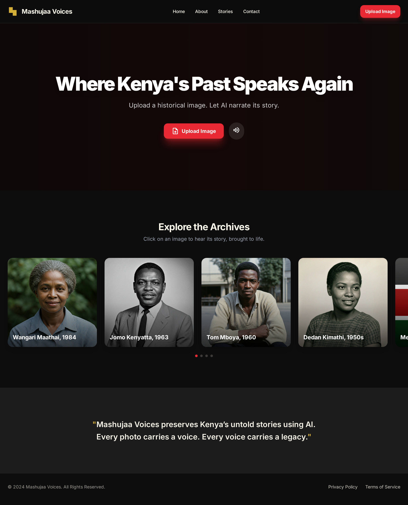
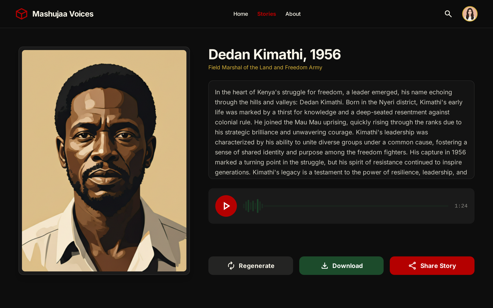
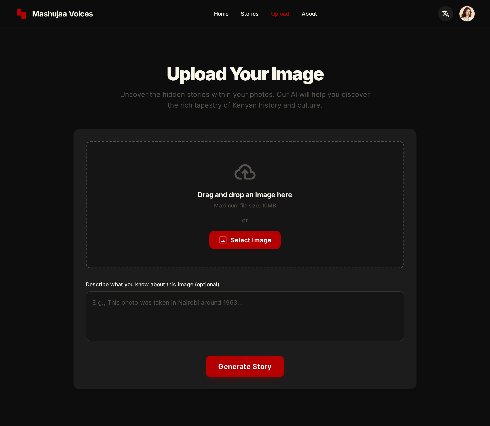

# Mashujaa Voices

Mashujaa Voices is a small web application that lets users upload images and synthesize storytelling audio from those images. The project combines a frontend (React + Vite) and a Python backend to process images, interact with language/image services, and generate audio files.

Core features
- Upload an image and analyze it for story prompts.
- Generate narrated stories and synthesized voice audio from image-based prompts.
- Simple audio player UI to play generated voice clips.

Where to look
- `frontend/` — React (TypeScript) UI built with Vite. Contains pages, components and a voice synthesis client.
- `backend/` — Python API server that handles image processing, voice synthesis calls, and stores generated audio in `backend/audio_files/`.
- `mokeUp/` — UI mockups and sample pages used during design. Included below are screenshot previews of the main pages.

Mockups
The following images are taken from `mokeUp/home_page_-_mashujaa_voices` and show the intended UI for the Home, Stories and Upload pages.

Development

- Backend: see `backend/README.md` for backend-specific setup and API docs.
- Frontend: run `npm install` and `npm run dev` inside the `frontend/` folder.

